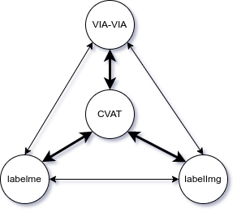

# 2Label - Annotation Format Conversion Tool

<div align="center">
    
    <p><em>A comprehensive toolkit for converting between various image annotation formats</em></p>
</div>

## Overview

2Label is a toolkit designed to simplify the process of converting between different annotation formats used in computer vision and image labeling tasks. It supports conversions between popular annotation tools like CVAT, LabelImg, LabelMe, VIA, COCO, YOLO, and more.

## Features

- **Multiple Format Support**: Convert between various annotation formats
- **Batch Processing**: Process multiple files at once
- **Data Integrity**: Preserves annotation data during conversion
- **Extensible**: Easy to add support for new annotation formats

## Supported Annotation Tools & Formats

| Tool/Format | Description | Installation |
|-------------|-------------|-------------|
| [LabelImg](https://github.com/heartexlabs/labelImg) | Graphical image annotation tool | `pip install labelImg` |
| [LabelMe](https://github.com/wkentaro/labelme) | Image polygonal annotation tool | `pip install labelme` |
| [VIA](https://www.robots.ox.ac.uk/~vgg/software/via/) | VGG Image Annotator | Web-based (no installation needed) |
| [CVAT](https://github.com/opencv/cvat) | Computer Vision Annotation Tool | See [CVAT installation guide](https://github.com/opencv/cvat) |
| [PixelAnnotationTool](https://github.com/abreheret/PixelAnnotationTool) | Tool for pixel-wise annotation | See [PixelAnnotationTool repo](https://github.com/abreheret/PixelAnnotationTool) |
| COCO | Common Objects in Context | JSON format |
| YOLO | You Only Look Once | TXT format |
| Pascal VOC | Visual Object Classes | XML format |

## Installation

```bash
# Clone the repository
git clone https://github.com/yourusername/2label.git
cd 2label

# Install required dependencies
pip install -r requirements.txt  # (Create this file with necessary dependencies)
```

## Usage Examples

### Converting from LabelMe to COCO format

```bash
python convert/labelme_coco.py --input_dir /path/to/labelme/annotations --output_file /path/to/output/coco.json
```

### Converting from VIA to LabelMe format

```bash
python convert/via_labelme3.py --input_file /path/to/via/project.json --output_dir /path/to/output/labelme
```

## Project Structure

- `convert/` - Conversion scripts between different annotation formats
- `utils/` - Utility functions for data processing and visualization
- `datasets/` - Example datasets and test cases
- `docs/` - Documentation for specific conversion workflows
- `via/` - VIA-related resources and utilities

## Documentation

For detailed documentation on specific conversion workflows, see the [docs](./docs) directory.

## License

This project is licensed under the terms of the LICENSE file included in this repository.

## Contributing

Contributions are welcome! Feel free to submit a Pull Request.

## Citation

If you use this tool in your research, please cite:

```
@software{2label,
  author = {Your Name},
  title = {2Label: A Tool for Converting Between Annotation Formats},
  year = {2023},
  url = {https://github.com/yourusername/2label}
}
